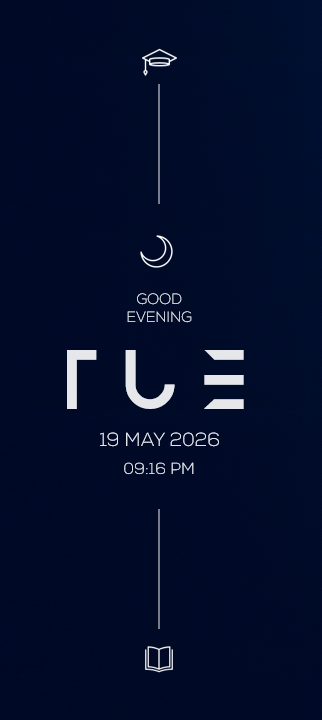

## Ayanami Rei


Wallpaper: [Ayanami Rei](https://steamcommunity.com/sharedfiles/filedetails/?id=3258032485)

# Soluna Rainmeter Skin

Minimal vertical Rainmeter skin inspired by Mond aesthetic.

## Features

- Dynamic day/night icons
- Vertical minimal layout
- Real-time greeting system
- Adaptive time phase icons
- Clean futuristic design

## Preview



## Installation

1. Install Rainmeter
2. Download this repository
3. Copy `Soluna` folder into:

```text
Documents\Rainmeter\Skins
```

4. Refresh Rainmeter
5. Load `Soluna.ini`

## Required Fonts

This skin uses the following fonts for the intended aesthetic and layout:

- Anurati
- Montserrat
- Nexa *(Light / Thin)*

All required font files are included in:

```text
Skins\Soluna\@Resources\Fonts
```

Install all fonts before loading the skin to ensure proper rendering.

## Credits

Created by **Goa**